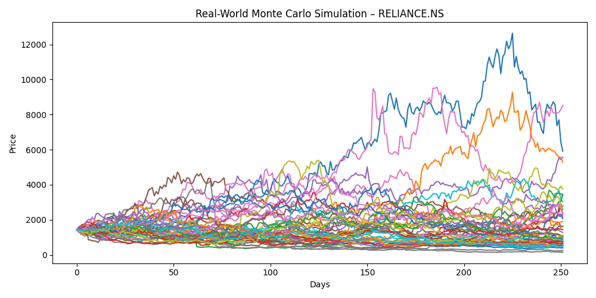

# Monte Carlo Simulation – Reliance Industries

## Objective
-To analyze long-horizon downside risk for Reliance Industries using
Monte Carlo simulation, and to understand why probability-of-loss
metrics can remain elevated even over multi-year investment horizons.

## Why Reliance?
-Reliance Industries was chosen due to its long trading history,
high liquidity, and exposure to multiple economic regimes.
-Its structural growth over time makes it a useful case study
for evaluating the limitations of standard Monte Carlo assumptions
when applied to long-term equity investing.

## Methodology
- Historical daily log returns were computed from price data
- Mean return and volatility were estimated from this return series
- 20,000 Monte Carlo price paths were simulated
- Each simulation covered a 5-year investment horizon

~ This framework assumes returns are independent, identically distributed,
and representative of future behavior.

## Key Observations
- Probability of loss remains elevated even over a 5-year horizon
- The distribution of outcomes is highly skewed rather than symmetric
- A small number of extreme downside paths dominate risk metrics

~ Despite positive average and median outcomes, tail risk materially
influences loss probabilities.

## Limitations
- Assumes stationary return distributions over time
- Does not distinguish between normal and crisis regimes
- Tends to overestimate downside risk for structurally growing firms

~ These limitations are inherent to classical Monte Carlo frameworks
and motivate more regime-aware approaches.

## Next Improvements
- Regime-based volatility estimation
- Drawdown- and recovery-focused risk metrics
- SIP vs lump sum deployment analysis

## How to Read the Outcome Distribution Plot

Each bar in the histogram represents the frequency of final simulated
prices after a 5-year investment horizon.

### How this plot was generated
- Daily log returns were calculated from historical price data
- Mean and volatility were estimated from this return series
- 20,000 random price paths were simulated over 5 years
- The final price from each simulation was recorded
- These final prices were aggregated into a histogram

### How to interpret the plot
- The x-axis shows possible final price outcomes after 5 years
- The y-axis represents probability density
- The distribution exhibits right skewness with a pronounced left tail
- While most outcomes are positive, rare extreme losses significantly
  influence overall loss probability

### Why this matters
-This visualization illustrates why probability-of-loss metrics can be
misleading for long-term investors. Tail risk dominates the distribution,
even when expected outcomes are favorable, highlighting the importance
of drawdown-based risk measures alongside traditional metrics.
